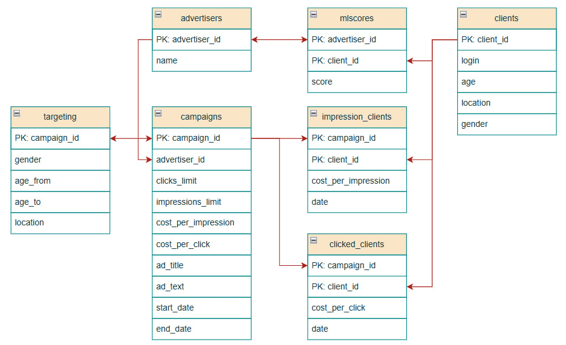
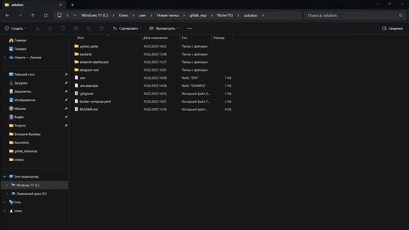

# Backend-container

## Оглавление
* **[Точки входа](#основные-точки-входа-в-приложение)**
* **[Схема данных](#схема-данных-субд)**
* **[Демонстрация запуска](#демонстрация-запуска)**
* **[Тестирование](#тестирование)**

## Основные точки входа в приложение

#### Клиенты
| Метод | Endpoint | Описание   |
|-------|----------|----------  |
| GET   | `/clients/{clientId}` | Получение информации о клиенте |
| POST  | `/clients/bulk`       | Добавление клиентов кучей      |

#### Рекламодатели
| Метод | Endpoint | Описание |
|-------|----------|----------|
| GET   | `/advertisers/{advertiserId}` | Получение информации о рекламодателе |
| POST  | `/advertisers/bulk`           | Добавление рекламодателей кучей |

#### ML Скоры
| Метод | Endpoint | Описание |
|-------|----------|----------|
| POST  | `/ml-scores` | Расчет ML скоров |

#### Кампании
| Метод | Endpoint | Описание |
|-------|----------|----------|
| POST  | `/advertisers/{advertiserId}/campaigns`                 | Создание кампании |
| GET   | `/advertisers/{advertiserId}/campaigns`                 | Получение списка кампаний |
| GET   | `/advertisers/{advertiserId}/campaigns/{campaignId}`    | Получение информации о кампании |
| PUT   | `/advertisers/{advertiserId}/campaigns/{campaignId}`    | Обновление кампании |
| DELETE | `/advertisers/{advertiserId}/campaigns/{campaignId}`   | Удаление кампании |

#### Реклама
| Метод | Endpoint | Описание |
|-------|----------|----------|
| GET   | `/ads` | Получение списка рекламных объявлений     |
| POST  | `/ads/{adId}/click` | Регистрация клика по рекламе |

#### Статистика
| Метод | Endpoint | Описание |
|-------|----------|----------|
| GET   | `/stats/campaigns/{campaignId}`                     | Получение статистики по кампании |
| GET   | `/stats/advertisers/{advertiserId}/campaigns`       | Статистика по кампаниям рекламодателя |
| GET   | `/stats/campaigns/{campaignId}/daily`               | Дневная статистика по кампании |
| GET   | `/stats/advertisers/{advertiserId}/campaigns/daily` | Дневная статистика по кампаниям рекламодателя |

#### Время
| Метод | Endpoint | Описание |
|-------|----------|----------|
| GET   | `/time`  | Получение текущего времени |
| POST  | `/time/advance` | Установка времени |

#### Модерация
| Метод | Endpoint | Описание |
|-------|----------|----------|
| POST  | `/moderation/active`   | Включение/выключение модерации |
| POST  | `/moderation/strict`   | Строгая/Нестрогая модерация |
| GET   | `/moderation/banwords` | Получение бан-слов |
| POST  | `/moderation/banwords` | Добавление бан-слов |
| DELETE | `/moderation/banwords` | Удаление бан-слов |

#### Картинки
| Метод | Endpoint | Описание |
|-------|----------|----------|
| GET   | `/images` | Получение определенной картинки по ключу  |
| POST  | `/images/{campaignId}` | Загрузка фото                |
| GET   | `/images/{campaignId}` | Получение всех фото кампании |


## Тестирование

Для тестирования был реализован отдельный контейнер со всеми зависимостями для простоты использования.
Всё, что нужно сейчас - это запустить контейнер одной из нескольких команд.

```bash
cd ./solution
```
Обязательно перейти в папку `./solution` для запуска через docker-compose

### Все тесты одновременно
```bash
# Запустить тесты (с постфиксом [e2e, unit, all])
docker-compose run testing-service all
```

### e2e Tests
```bash
# Запустить тесты (с постфиксом [e2e, unit, all])
docker-compose run testing-service e2e
```

### Unit Tests
```bash
# Запустить тесты (с постфиксом [e2e, unit, all])
docker-compose run testing-service unit
```

## Схема данных СУБД



## Демонстрация запуска

