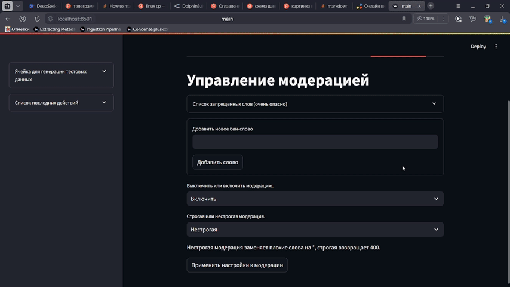

# Streamlit-дашборд

Оглавление:
* **[Функционал дашборда](#функционал)**
* **[Демонстрация работы дашборда](#демонстрация)**

## Функционал

- Управление модерацией и временем
- Создание своих данных (кампаний, пользователей, рекламодателей) **[DEMO](#создание-кампании-через-дашборд)**
- Отображение графиков кампаний и рекламодателей (демо в этом README).
- Имитация кликов и получения рекламы **[DEMO](#получение-пользователем-рекламы-и-клик-на-неё)**
- Генерация текста с помощью ИИ **[DEMO](#генерация-текста-с-помощью-ии)**

## Переменные среды

```python
# Для работы с Streamlit необходимо указать базовый URL Backend
BACKEND_BASEURL=<baseurl>
```
Проект запускается из папки `solution` с помощью `docker-compose.yaml`, зависит от `backend`.

## Демонстрация

### Создание тестовых данных и их отображение в графиках


### Создание кампании через дашборд


### Генерация текста с помощью ИИ


### Получение пользователем рекламы и клик на неё
